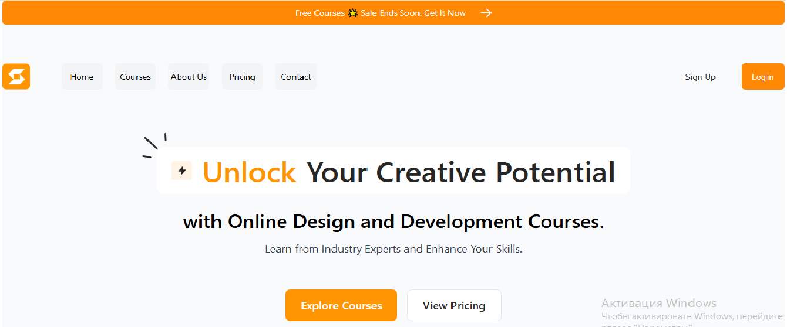

# Online Course New
Адаптивний сайт онлайн-курсів, розроблений на React.js, Vite та Tailwind CSS. Проєкт демонструє мої навички сучасної frontend-розробки, верстки та адаптації інтерфейсу під різні пристрої.

## ✨ Технології
React.js — бібліотека для створення користувацьких інтерфейсів

Vite — сучасний збирач із швидким dev-сервером

Tailwind CSS — утилітарний CSS-фреймворк для швидкої верстки

Адаптивна верстка — сайт коректно відображається на мобільних, планшетах і десктопах

## 🧩 Структура проєкту
Компонентна архітектура React

Tailwind-класи для стилізації

Семантична HTML5-розмітка

## 📸 Скриншот


## 🚀 Запуск проекта

1. Клонувати репозиторий:
   ```bash
   git clone https://github.com/yourusername/online-course-new.git
   cd online-course-new

2. Встановити залежності:
   npm install
3. Запустити локальний сервер:
   npm run dev
4. Проєкт розроблений для портфоліо та демонстрації навичок фронтенд-розробки. Буду рада пропозиціям щодо співпраці.